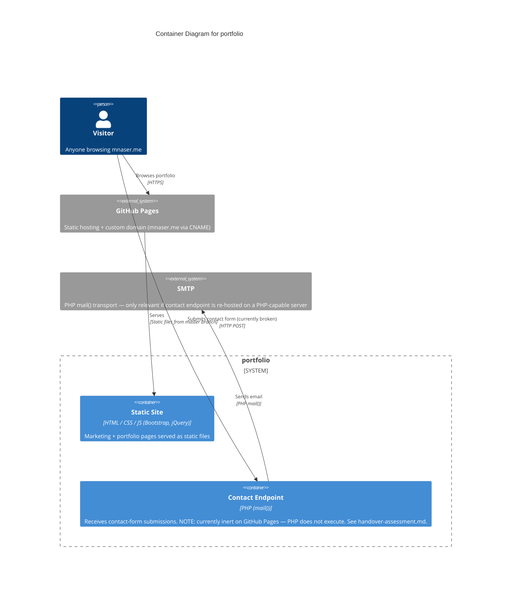

# Container Diagram — portfolio

> **C4 Level 2** — the system broken down into deployable/runnable containers. Audience: the dev team. One diagram per managed project; usually zoomed in from the L1 context diagram.

## Diagram

> **Note**: this diagram was auto-generated by /handover on 2026-05-17 from repo signals (file tree, `CNAME`, `prepros-6.config`, `contact_process.php`). It is a **starting point** — review and refine.
>
> - Container labels and tech strings — the detector may have picked a framework version wrong
> - Inferred relationships — `visitor → pages` assumes HTTPS via GitHub Pages; adjust if your stack uses something else
> - External systems — anything your team uses that isn't in the file tree (e.g. analytics, error tracking, third-party form services) won't have been detected
>
> Update the "Maintenance" section below once the diagram is stable.

## Maintenance

(From the template — update when L2 containers change.)
